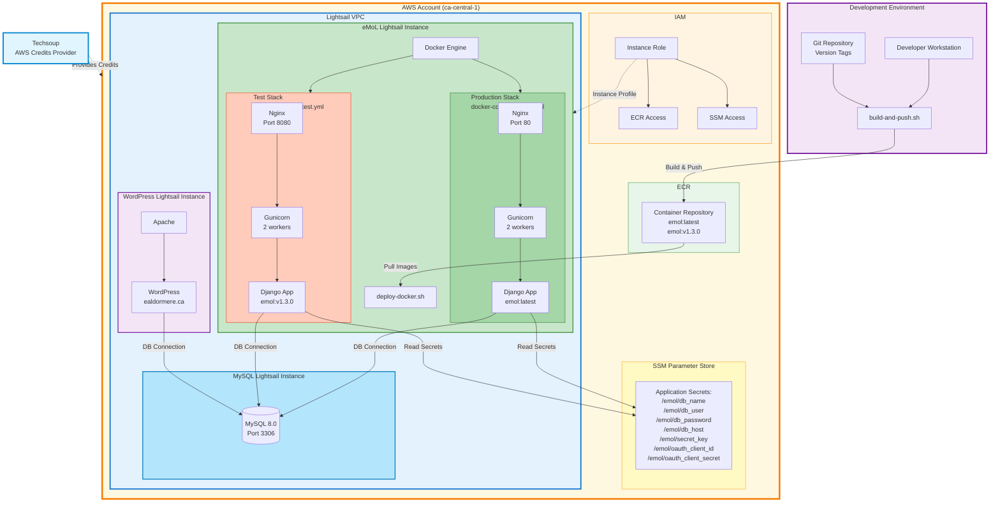
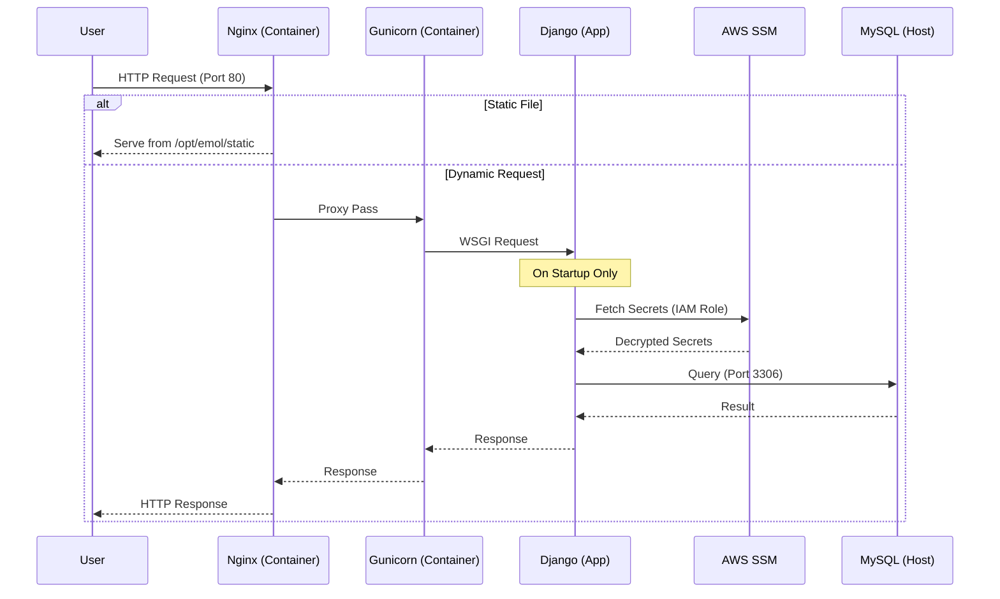

# eMoL Technical Architecture

This document provides a detailed technical overview of the eMoL (Electronic Minister of Lists) system architecture. It is intended for developers, system administrators, and DevOps engineers.

## System Components

### Infrastructure (AWS ca-central-1)

The system runs on AWS Lightsail within the `ca-central-1` region, leveraging several AWS managed services for security and operations.



*   **Compute**:

    *   **eMoL Instance**: Lightsail OS-only bundle (Ubuntu 22.04), 1GB RAM, 2 vCPUs. Runs Docker Engine.
    *   **MySQL Instance**: Lightsail OS-only bundle, 1GB RAM, 2 vCPUs. Runs MySQL 8.0 natively.
    *   **WordPress Instance**: Lightsail instance hosting `ealdormere.ca`. Connects to the shared MySQL instance.
*   **Networking**:
    *   All instances reside in the default Lightsail VPC for `ca-central-1`.
    *   Communication between instances uses private IP addresses.
    *   Security groups (Lightsail Firewall) restrict access:
        *   **MySQL**: Port 3306 open only to private VPC IPs.
        *   **Web**: Ports 80/443 open to the world.
*   **Storage**:
    *   **ECR (Elastic Container Registry)**: Stores private Docker container images.
    *   **SSM Parameter Store**: Stores application secrets (DB credentials, API keys) as SecureStrings.
*   **Identity**:
    *   **IAM Roles**: The Lightsail instance uses an attached IAM instance profile to access ECR and SSM without long-term credentials.

### Application Stack (Containerized)

The eMoL application is fully containerized using Docker.

*   **Base Image**: `python:3.13-slim`
*   **Web Server**: Nginx (serving static files and reverse proxying)
*   **App Server**: Gunicorn (WSGI server, 2 sync workers)
*   **Application**: Django 4.2+
*   **Dependencies**: Managed via Poetry, installed system-wide in the container.

## Deployment Pipeline

We use a semi-automated deployment workflow that supports testing before production cutover.

### 1. Build & Release (Local)

Developer runs `setup_files/build-and-push.sh`:
1.  **Tagging**: Reads the latest git tag (e.g., `v1.3.0`).
2.  **Build**: Builds `Dockerfile.prod`.
3.  **Push**: Pushes tags `emol:latest` and `emol:v1.3.0` to ECR.
4.  **Version Control**: Updates the local `VERSION` file.

### 2. Staging/Test (Remote)

On the Lightsail instance, run `setup_files/host/deploy-docker.sh --test`:
1.  **Pull**: Fetches the specified (or latest) image from ECR.
2.  **Compose**: Generates `docker-compose.test.yml`.
3.  **Deploy**: Starts the container on **host port 8080**.
4.  **Verify**: Manual verification at `http://<ip>:8080`.

### 3. Production Cutover (Remote)

On the Lightsail instance, run `setup_files/host/deploy-docker.sh --cutover`:
1.  **Stop**: Stops the test container (8080) and any legacy systemd services.
2.  **Compose**: Generates `docker-compose.prod.yml`.
3.  **Deploy**: Starts the container on **host port 80**.
4.  **Cleanup**: Prunes unused Docker images.

## Secrets Management

Secrets are strictly separated from the codebase and image.

1.  **Storage**: AWS Systems Manager (SSM) Parameter Store (`SecureString`).
2.  **Access**:
    *   The EC2/Lightsail instance has an IAM role with `ssm:GetParameters`.
    *   The Django settings (`emol.settings.prod`) fetch secrets at runtime using `boto3`.
3.  **Parameters**:
    *   `/emol/db_name`, `/emol/db_user`, `/emol/db_password`, `/emol/db_host`
    *   `/emol/secret_key`
    *   `/emol/oauth_client_id`, `/emol/oauth_client_secret`

## Database Architecture

A single MySQL Lightsail instance serves as the backend for multiple services to optimize costs.

*   **Topology**: Standalone MySQL 8.0 server.
*   **Databases**:
    *   `emol`: The main application database.
    *   `wordpress`: For the kingdom website.
*   **Backup**: Lightsail automated snapshots + manual SQL dumps.

## Network & Security Flow



## Directory Structure (On Host)

```
/home/ubuntu/emol/
├── docker-compose.prod.yml      # Generated active config
├── docker-compose.test.yml      # Generated test config
├── VERSION                      # Current deployed version
└── setup_files/
    └── host/
        └── deploy-docker.sh     # Deployment control script
```

## Monitoring & Logs

*   **Application Logs**: Streamed to stdout/stderr, captured by Docker logging driver.
    *   View: `docker-compose logs -f`
*   **Access Logs**: Nginx and Gunicorn logs are mounted to host volumes:
    *   `/var/log/emol/` (Gunicorn/Django)
    *   `/var/log/nginx/` (Nginx)
*   **Health Checks**: Docker healthcheck configured in `docker-compose.yml` curls `localhost:80` to ensure responsiveness.

