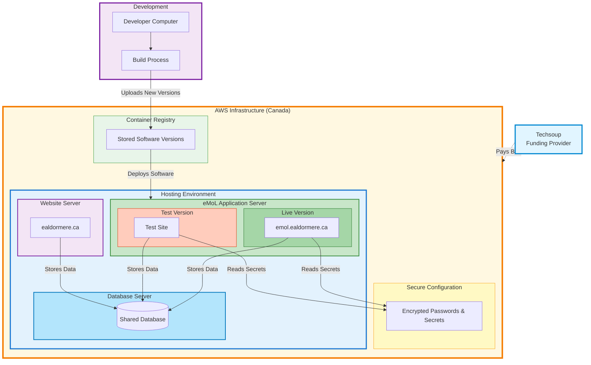

# eMoL System Architecture

## Overview

eMoL (Electronic Minister of Lists) is the system used to manage combat authorizations and other lists for the Kingdom of Ealdormere. This document explains how the system is hosted and structured.

The system runs on **AWS (Amazon Web Services)** and is funded by **Techsoup credits**, making it extremely cost-effective for the kingdom. We share some infrastructure with the main kingdom website to further reduce costs.

## Architecture Diagram



## Component Details

### External: Techsoup
- Non-profit technology provider
- Provides AWS credits for eligible organizations

### External: Development Environment
- **Developer Workstation**: Local development machine
- **Git Repository**: Source code with semantic version tags (v1.3.0, v1.3.1, etc.)
- **build-and-push.sh**: Builds Docker images and pushes to ECR
- **Workflow**: Tag → Build → Push → Deploy

### AWS Account (ca-central-1 Region)

#### IAM (Identity and Access Management)
- **Instance Role**: Attached to eMoL Lightsail instance via instance profile
- **ECR Access Policy**: Allows pulling Docker images from ECR
- **SSM Access Policy**: Allows reading secrets from Parameter Store
- **Security**: No static credentials needed on instance

#### ECR (Elastic Container Registry)
- Stores versioned Docker images of the eMoL application
- Tags: `emol:latest`, `emol:v1.3.0`, `emol:v1.3.1`, etc.
- Images built with `Dockerfile.prod`
- Automatic vulnerability scanning enabled

#### SSM Parameter Store
- Securely stores application secrets:
  - `/emol/db_name` - Database name
  - `/emol/db_user` - Database username
  - `/emol/db_password` - Database password
  - `/emol/db_host` - Database host
  - `/emol/secret_key` - Django secret key
  - `/emol/oauth_client_id` - Google OAuth client ID
  - `/emol/oauth_client_secret` - Google OAuth secret
- Encrypted at rest
- Accessed via AWS SDK using IAM role

#### Lightsail VPC

##### MySQL Lightsail Instance
- **Cost**: $7/month
- **Specs**: 1GB RAM, 2 vCPUs
- **Database**: MySQL 8.0
- **Port**: 3306 (accessible only within VPC)
- **Purpose**: Shared database server
- **Databases**:
  - `emol` - eMoL application database
  - `wordpress` - ealdormere.ca WordPress database
  - Additional databases for other services as needed
- **Management**: Separate instance for easier backup/restore and shared use

##### WordPress Lightsail Instance (ealdormere.ca)
- **Cost**: $10/month
- **Specs**: 1GB RAM, 1 vCPU, 40GB SSD
- **Stack**: Apache + PHP + WordPress
- **Domain**: ealdormere.ca
- **Database**: Uses shared MySQL instance
- **Purpose**: Kingdom of Ealdormere main website
- **Note**: $10/month is overkill for traffic but not our decision

##### eMoL Lightsail Instance
- **Cost**: $7/month
- **Specs**: 1GB RAM, 2 vCPUs, 40GB SSD
- **OS**: Ubuntu 22.04
- **Components**:
  - Docker Engine
  - deploy-docker.sh script
  - Production and Test stacks

###### Production Stack (Port 80)
- **Compose File**: `docker-compose.prod.yml`
- **Container Image**: `emol:latest`
- **Components**:
  - Nginx: Serves static files, reverse proxy to Gunicorn
  - Gunicorn: 2 workers, WSGI server
  - Django: Application code
- **Volumes**: `static`, `emol_logs`, `nginx_logs`
- **Purpose**: Serves production traffic

###### Test Stack (Port 8080)
- **Compose File**: `docker-compose.test.yml`
- **Container Image**: Specific version (e.g., `emol:v1.3.0`)
- **Components**:
  - Nginx: Serves static files, reverse proxy to Gunicorn
  - Gunicorn: 2 workers, WSGI server
  - Django: Application code
- **Volumes**: `static_test`, `emol_logs_test`, `nginx_logs_test` (separate from prod)
- **Purpose**: Test new versions before cutover
- **Can run simultaneously with production**

## Deployment Flow

### 1. Local Development → ECR

```bash
# Developer tags a release
git tag v1.3.0
git push --tags

# Build and push to ECR
./setup_files/build-and-push.sh --account-id <id>
```

**Process**:
- Reads latest git tag (e.g., `v1.3.0`)
- Builds Docker image from `Dockerfile.prod`
- Tags image as `emol:v1.3.0` and `emol:latest`
- Pushes both tags to ECR
- Updates local `VERSION` file

### 2. ECR → Lightsail Instance (Test)

```bash
# On Lightsail instance
cd ~/emol
./setup_files/host/deploy-docker.sh --registry <url> --test
```

**Process**:
- Queries ECR for latest version
- Pulls image from ECR
- Creates/updates `docker-compose.test.yml`
- Starts container on port 8080
- Production on port 80 remains running
- Reads secrets from SSM Parameter Store
- Connects to MySQL database

### 3. Test → Production (Cutover)

```bash
# After testing looks good
./setup_files/host/deploy-docker.sh --registry <url> --cutover
```

**Process**:
- Pulls latest image from ECR
- Stops old systemd service (if running)
- Stops test container on port 8080
- Creates/updates `docker-compose.prod.yml`
- Starts container on port 80
- Cleans up old Docker images

### Container Startup Sequence

1. Container starts with `docker-entrypoint-prod.sh`
2. Reads secrets from SSM Parameter Store using IAM role
3. Connects to MySQL database
4. Runs Django migrations (`python manage.py migrate`)
5. Collects static files (`python manage.py collectstatic`)
6. Creates cache table if needed
7. Creates superuser if specified
8. Starts Nginx
9. Starts Gunicorn with 2 workers
10. Container marked as healthy

## Network Flow

### External Request Flow
```
Internet → Port 80/8080 → Nginx (in container)
                        → Gunicorn (WSGI server)
                        → Django Application
                        → MySQL Database (separate instance)
```

### Internal Service Flow
```
Container → IAM Role → SSM Parameter Store (read secrets)
Container → VPC → MySQL Instance (database queries)
```

## Security

- **Secrets**: Stored in SSM Parameter Store, never in code or environment variables
- **IAM Roles**: Instance uses IAM role for AWS service access (no static credentials)
- **Network**: Database only accessible from localhost
- **HTTPS**: Handled by external reverse proxy (if configured)

## Cost Structure

### Monthly Costs
- **MySQL Lightsail Instance**: $7/month (1GB RAM, 2 vCPUs) - Shared
- **WordPress Lightsail Instance**: $10/month (1GB RAM, 1 vCPU, 40GB SSD) - ealdormere.ca
- **eMoL Lightsail Instance**: $7/month (1GB RAM, 2 vCPUs, 40GB SSD) - emol.ealdormere.ca
- **ECR Storage**: ~$0.50/month (minimal, <5GB)
- **ECR Data Transfer**: Free within same region
- **SSM Parameter Store**: Free tier (< 10,000 parameters)
- **Data Transfer**: Minimal (mostly within VPC)

**Total**: ~$25/month before credits

### Cost Optimization
- **Techsoup AWS Credits**: Covers most/all costs for eligible non-profits
- **Single Region**: All resources in ca-central-1 (no cross-region charges)
- **Shared MySQL**: Database instance serves both eMoL and WordPress
- **Efficient Instance Sizing**: Right-sized for low-traffic applications
- **Docker Volumes**: Reuse static files between deployments
- **VPC Peering**: Database connections within VPC (no data transfer charges)

### Notes on Costs
- WordPress instance is oversized for current traffic but maintained for consistency
- Shared MySQL instance reduces overall cost vs. separate databases
- All costs covered by Techsoup AWS credits

