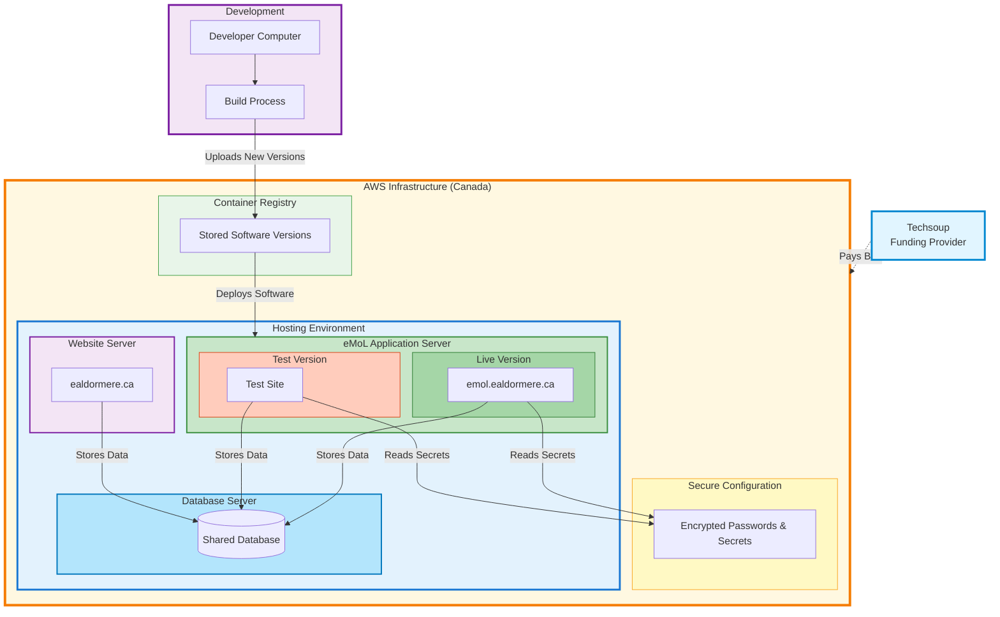

# eMoL System Overview

## What is eMoL?

eMoL (Electronic Minister of Lists) is the online system used to manage combat authorizations and related records for the Kingdom of Ealdormere. Combatants can view their authorization cards online, and authorized marshals and officers can update authorization information securely.

## System Capabilities

eMoL allows:
- **Combatants** to view their authorization cards online using a secure link
- **Marshals and Officers** to update authorization dates, add new authorizations, and manage combatant information
- **Kingdom Officers** to generate reports and rosters
- **Automatic reminders** to be sent when authorizations are approaching expiration

All sensitive information (legal names, addresses, phone numbers) is encrypted and only accessible to authorized personnel.

## System Architecture

The following diagram shows how the different components of the system work together:

### Component Overview

**Techsoup (Funding Provider)**
- Non-profit organization that provides cloud computing credits to eligible organizations
- Covers the hosting costs for eMoL

**Development Environment**
- Where volunteers develop and test new features and improvements
- Changes are prepared and packaged before being deployed to the live system

**Container Registry (Software Storage)**
- Stores all versions of the eMoL software
- Allows the system to keep track of different versions and roll back if needed

**Secure Configuration (Password Storage)**
- Encrypted storage for all passwords and security keys
- Ensures sensitive configuration data is never stored in code or exposed

**Database Server**
- Stores all combatant data, authorizations, and system information
- Shared between eMoL and the kingdom website to reduce costs
- Only accessible by the application servers (not from the internet)

**Kingdom Website Server (ealdormere.ca)**
- Hosts the main Kingdom of Ealdormere website
- Shares the database server with eMoL for cost efficiency

**eMoL Application Server**
- **Live Version**: The production system that combatants and officers use daily
- **Test Version**: A separate copy used to test updates before they go live
- Both versions can run simultaneously, allowing safe testing without disrupting service

## Hosting and Reliability

eMoL runs on **Amazon Web Services (AWS)**, a major cloud provider. This means:
- The system is available 24/7 from anywhere with internet access
- Data is automatically backed up and stored securely
- The system can handle traffic spikes without interruption
- Updates can be deployed without downtime

The system is hosted in Canada (Toronto region) to ensure data stays within Canadian borders and complies with privacy regulations.

## Funding and Costs

eMoL is funded through **Techsoup**, a non-profit technology provider that offers cloud computing credits to eligible organizations. This makes the system extremely cost-effective for the kingdom.

**Monthly Operating Costs:**
- Database server (shared with kingdom website): $7/month
- eMoL application server: $7/month
- Kingdom website server: $10/month
- Cloud storage and services: ~$1/month

**Total: Approximately $25/month**

All costs are covered by Techsoup AWS credits, meaning **the kingdom pays nothing** for hosting the system.

### Cost Efficiency

The system is designed to minimize costs:
- The database server is shared between eMoL and the kingdom website, reducing overall expenses
- Resources are sized appropriately for our traffic levels
- All services are located in the same region to avoid additional fees

## Security

eMoL takes security seriously:
- All passwords and sensitive configuration data are stored in encrypted, secure storage
- The database is only accessible from the application server (not directly from the internet)
- User access is controlled through Google OAuth (the same login system used by many organizations)
- Sensitive combatant information (legal names, addresses) is encrypted in the database
- Only authorized personnel can view or modify sensitive data

## System Updates

When improvements or fixes are needed:
1. Changes are tested on a separate test version of the system
2. After testing confirms everything works correctly, the update is applied to the live system
3. The system remains available during updates (no downtime)
4. Previous versions are kept available in case a rollback is needed

This process ensures that updates don't disrupt service and can be safely tested before going live.

## Data Management

- All combatant data is stored in a secure database
- The database is automatically backed up as part of the hosting service
- Data can be exported for reporting or backup purposes
- The system maintains a complete history of changes

## Support and Maintenance

The system is maintained by volunteer developers. Technical documentation is available for future maintainers, and the system is designed to be reliable and require minimal ongoing maintenance.

## Summary

eMoL provides a secure, reliable, and cost-effective way to manage combat authorizations for the Kingdom of Ealdormere. The system runs on professional cloud infrastructure, costs the kingdom nothing thanks to Techsoup credits, and provides the security and reliability needed to manage sensitive combatant information.
